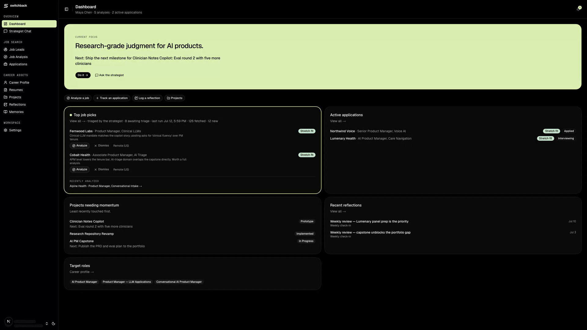
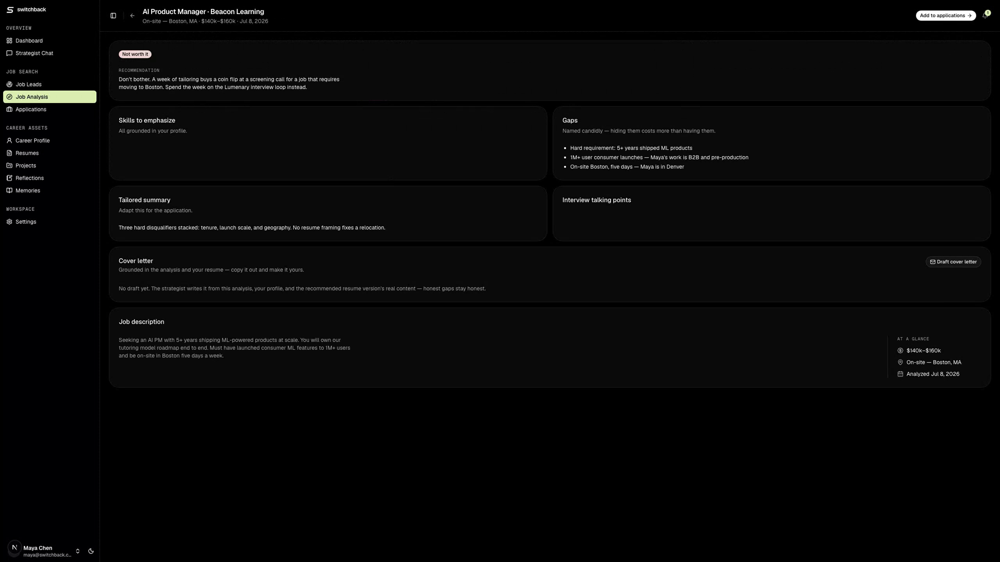
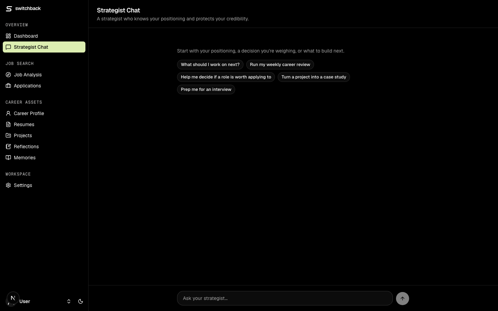

# Switchback

**Same mountain. Higher ground.**

A private AI career operating system for technical professionals. A switchback is how you climb a slope too steep to walk straight up: you turn, and every turn gains altitude. That's the product's philosophy — career changes are switchbacks, not restarts.

Switchback turns scattered career activity — positioning, resume versions, job postings, applications, projects, reflections — into a compounding system, with an embedded AI strategist that knows your context and protects your credibility.



## Status

**Live in production** — all eight PRD modules working end-to-end, deployed on Vercel behind Neon Auth. Single-user by design for now; multi-tenant onboarding is future work. See [`tasks/todo.md`](tasks/todo.md) for the build log and [`docs/prd.md`](docs/prd.md) for the original PRD (written under the working title *Career Strategist OS*).

## What it does

| Module | What happens |
|---|---|
| **Strategist Chat** | An Eve-powered agent with 19 typed tools and 11 skills. Reads your profile and memories at conversation start; writes reflections, decisions, analyses, projects, resume content, and applications with your confirmation. |
| **Job Sourcing** | A scheduled run (Mon/Wed/Fri) pulls fresh postings from Adzuna searches and watched company job boards (Greenhouse/Lever/Ashby), dedupes them, and triages each against your profile — most get dismissed, honestly. Survivors land on the dashboard and in the leads inbox; one click runs a full analysis in the background and the notification bell tells you when it's ready. Stale leads are swept automatically. |
| **Job Analysis** | Paste a posting (or just its URL — the agent fetches it). Get an honest fit classification, a resume recommendation with reasoning, gaps named candidly, a tailored summary, and interview talking points. One click converts it to a tracked application. |
| **Application Tracker** | Pipeline statuses, follow-up dates, fit badges, resume version used, decision reasoning. |
| **Project Asset Pipeline** | Each project generates career proof: case study drafts, LinkedIn posts in your voice, and the smallest useful next milestone — all capped at the project's honest status label. |
| **Reflections & Memory** | A chronological career journal, plus durable memories (constraints, preferences, rules) the strategist recalls in every future conversation — inspectable and editable. |
| **Weekly Review** | A scheduled agent run every Monday summarizes what moved, what stalled, what's due, and what's next. |



## The credibility system

The product's core rule: **truthful positioning beats exaggerated positioning.** Credibility rules live in the database, in the agent's instructions, and in every skill. Fed a posting requiring production Kubernetes and Terraform (not in the profile), the strategist classifies it a *stretch fit*, lists both as gaps, and explicitly advises **not** to add them to the resume — then scripts the honest interview answer instead.

## Architecture

**Next.js owns the product. Neon owns the data and identity. Eve owns the agent.**

```text
Next.js 16 App Router (TypeScript · Tailwind 4 · shadcn/ui)
│  pages, server actions, forms          ── withEve() mounts the agent
│  src/proxy.ts                          ── Neon Auth session gate on every route
│
├── Neon Postgres · Prisma 7             ── 14 models: profile, resumes, job
│                                            leads, analyses, applications,
│                                            projects, case studies, reflections,
│                                            memories, decisions, outputs,
│                                            notifications
│
├── Neon Auth                            ── app sessions; issues the short-lived
│                                            JWTs the agent channel verifies
│
└── Eve agent (agent/)                   ── filesystem-first:
    ├── instructions.md                     persona + credibility hard limits
    ├── channels/eve.ts                     route auth: Neon Auth JWT (browser),
    │                                       Vercel OIDC (server), local dev
    ├── tools/        (19)                  typed Zod tools calling Prisma
    ├── skills/       (11)                  load-on-demand procedures
    ├── lib/job-sources/                    Adzuna + Greenhouse/Lever/Ashby
    │                                       adapters, dedupe, stale-lead sweep
    └── schedules/                          weekly review + Mon/Wed/Fri job
                                            sourcing (Vercel Cron)
```

Two paths reach the agent: the chat UI (`useEveAgent` with resumable sessions) and server actions that drive typed Eve sessions with Zod output schemas — the agent does the reasoning, the app persists the result. Full notes in [`docs/architecture.md`](docs/architecture.md).

## Design

The UI implements [`DESIGN.md`](DESIGN.md): a monochrome editorial core — black ink, white canvas, hairline borders, pill buttons, mono eyebrow labels — with pastel color blocks as the only accents (the dashboard focus block, fit-classification badges). Dark mode included.



## Deploy your own

[](https://vercel.com/new/clone?repository-url=https%3A%2F%2Fgithub.com%2Fesimscode%2Fswitchback&project-name=switchback&repository-name=switchback&env=AI_GATEWAY_API_KEY%2CNEON_AUTH_BASE_URL%2CNEON_AUTH_COOKIE_SECRET%2CAUTH_ALLOWED_EMAILS&envDescription=AI%20Gateway%20key%20powers%20the%20strategist%3B%20the%20Neon%20Auth%20values%20come%20from%20your%20Neon%20project%27s%20Auth%20tab.&envLink=https%3A%2F%2Fgithub.com%2Fesimscode%2Fswitchback%23deploy-your-own&stores=%5B%7B%22type%22%3A%22integration%22%2C%22integrationSlug%22%3A%22neon%22%2C%22productSlug%22%3A%22neon%22%7D%5D)

The button clones this repo, creates the Vercel project, and provisions a **Neon Postgres** database in the same flow (`DATABASE_URL` is injected automatically). You'll be asked for four values:

| Variable | Where it comes from |
|---|---|
| `AI_GATEWAY_API_KEY` | [Vercel AI Gateway](https://vercel.com/docs/ai-gateway) → API keys. Powers the strategist agent. |
| `NEON_AUTH_BASE_URL` | Neon Console → your project → branch → **Auth** → enable, then copy the Auth URL. |
| `NEON_AUTH_COOKIE_SECRET` | Generate one: `openssl rand -base64 32`. |
| `AUTH_ALLOWED_EMAILS` | Comma-separated emails allowed to sign up — pin the workspace to yourself. |

After the first deploy:

```bash
vercel env pull .env.local        # or copy the values from the dashboard
npx prisma migrate deploy         # create the schema
```

Then open the app, create your account, and let the onboarding conversation build your profile — the strategist interviews you and seeds the workspace itself. (`npx prisma db seed` exists for demo data; skip it so onboarding runs.) Optionally add your production domain as a **trusted origin** in the Neon Auth configuration and disable open sign-up once your account exists.

### Optional: Adzuna job sourcing

The proactive sourcing schedule works out of the box for **watched company job boards** (Greenhouse/Lever/Ashby public APIs — no account needed; edit the list in `agent/skills/source-jobs.md`). To add broad keyword search across job boards, create a free [Adzuna developer account](https://developer.adzuna.com) and set two more environment variables (locally and in Vercel):

| Variable | Where it comes from |
|---|---|
| `ADZUNA_APP_ID` | Adzuna developer dashboard → your application. |
| `ADZUNA_APP_KEY` | Same place. The free tier comfortably covers three runs a week. |

Without these, Adzuna queries are skipped gracefully — sourcing, triage, and analysis still run on the company boards, and you can always paste any posting into Job Analysis by hand.

## Running locally

```bash
pnpm install
cp .env.example .env.local   # fill in the values — same table as above
npx prisma migrate deploy
pnpm dev                     # Next.js + Eve agent runtime, one command
```

Requires Node 24+ and pnpm. `AUTH_ALLOWED_EMAILS` may stay unset locally (open sign-up); Neon Auth allows `localhost` origins by default.

## Stack

Next.js 16 · TypeScript · Tailwind CSS 4 · shadcn/ui · Neon Postgres + Neon Auth · Prisma 7 · [Eve](https://www.npmjs.com/package/eve) 0.20 · Claude via Vercel AI Gateway

## Roadmap

- Pluggable model providers, so users pick what's most affordable
- Multi-tenant data model with per-account onboarding (today: one workspace per deployment)
- Resume authoring upgrades (richer editor, tailoring flows writing straight to versions)
- CI with automated tests and preview deploys, replacing push-to-main
- Email alerts (Resend) when scheduled runs fail, beyond the in-app health line
- Security hardening (and a WAF) ahead of any hosted/cloud offering
- Outcome calibration: feed application results back into how triage and fit classification are judged

## Philosophy

Not a resume generator, not a job board, not therapy. A trusted strategist workspace that makes practical progress while never inventing experience, never overstating status, and always framing a career change as specializing — not starting over.
