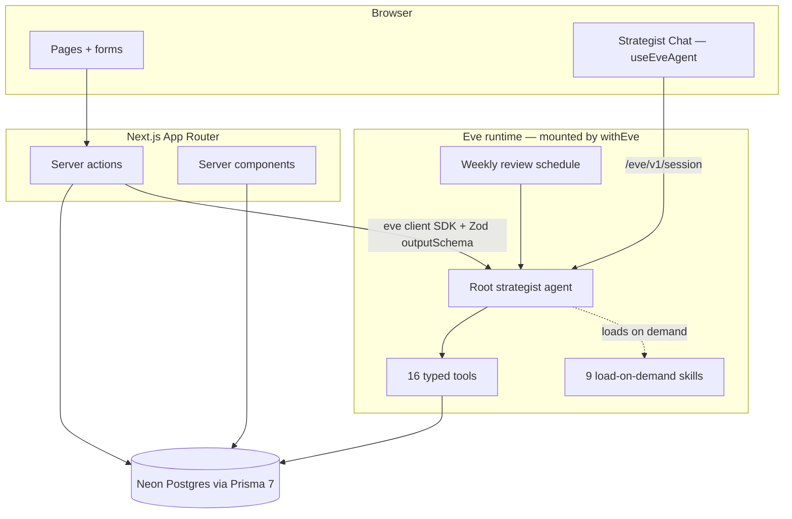

# Architecture Notes

## The rule

**Next.js owns the product. Neon owns the data. Eve owns the agent.**

The app stays a standard database-backed Next.js application. The agent layer is additive: remove `agent/` and `withEve()` and you still have a working career tracker; the agent gives it judgment.

## System diagram

## Two paths to the agent

1. **Conversational** — the chat page opens a durable Eve session (`useEveAgent`). The agent decides which tools to call; every write tool confirms with the user first. Sessions are resumable: the event log + session cursor persist in localStorage.
2. **Structured** — server actions (job analysis, case study, milestone, LinkedIn draft) drive a one-shot Eve session through the TypeScript client SDK with a Zod `outputSchema`. The agent does the reasoning (loading the relevant skill, reading the profile); the server action receives typed JSON and persists it with Prisma. The agent never writes in this path — persistence stays transactional in the app layer.

## Data model

Twelve Prisma models mirror the PRD: `users`, `career_profiles`, `resume_versions`, `job_analyses`, `applications`, `projects`, `case_studies`, `interview_stories`, `career_reflections`, `career_memories`, `strategic_decisions`, `agent_outputs`. Enums encode every status vocabulary (fit classifications, honest project labels, application pipeline, reflection types, memory categories). Agent-generated content is stored separately from source data (`agent_outputs`, `case_studies` with DRAFT status) per the PRD's tool design rules.

Conventions: camelCase fields `@map`ped to snake_case columns; pooled Neon URL for runtime, direct URL for migrations; the generated client lives in `src/generated/` (gitignored, regenerated by `prisma generate`).

## The credibility system

Three layers keep the agent honest:

1. **Data** — `credibility_rules` on the profile, honest status enums on projects, and seed memories like `no-overclaiming-rule`.
2. **Instructions** — hard limits in `agent/instructions.md` (never invent experience/metrics; status labels cap claims; "specializing, not starting over").
3. **Skills** — every generation procedure (analyze-job, tailor-resume, build-case-study, create-linkedin-post, prepare-interview) restates the constraint at the point of use.

## Notable decisions

- **Eve tools import Prisma via relative paths** (`agent/lib/db.ts`), not the `@/` alias — Eve compiles the agent tree independently of Next's tsconfig.
- **Shared Zod schemas** (`agent/lib/analysis-schema.ts`, `case-study-schema.ts`) serve double duty: output schema for structured sessions and input schema for the equivalent chat tools, so both paths persist identical shapes.
- **Memory keys are stable kebab-case** and upsert on `(userId, key)` — repeated saves update rather than duplicate.
- **Single user by design.** No auth in the MVP; Eve's default channel is fail-closed (localhost only in dev). Multi-user and deployment are explicitly post-MVP.

## Known limitations

- Structured generations run as blocking server actions (up to a few minutes for a case study). Streaming progress or a lighter model for drafts is the obvious next improvement.
- Chat history persists in localStorage, not the database — a `conversations` table is the natural upgrade.
- The weekly schedule fires only while the Eve runtime is running; a deployed environment makes it real.
